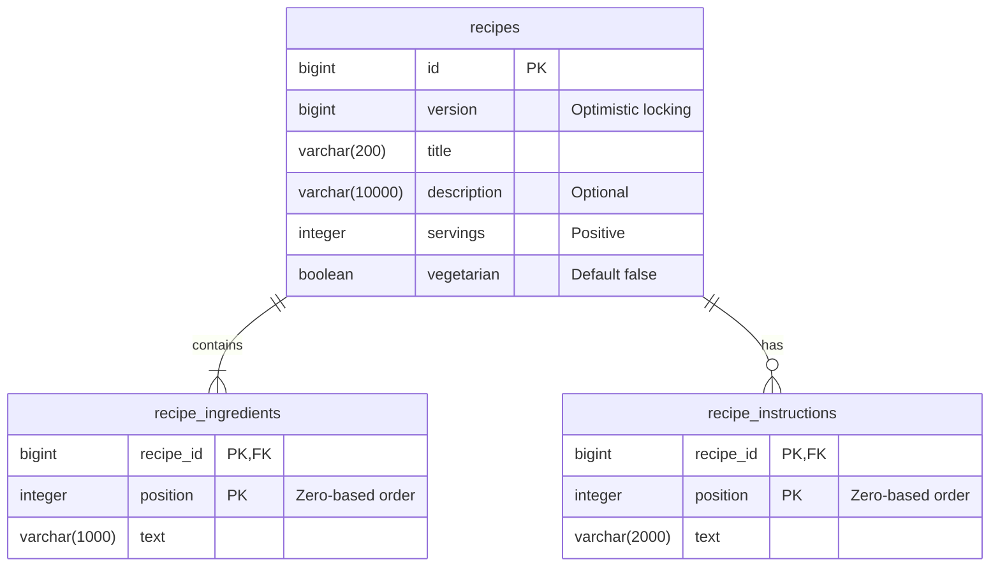

# Recipe API

This application is a sample backend for an app that acts a central for user recipes. It shows a quick glance at the culmination of my years of expertise in backend development.

Java 17 / Spring Boot 3.5.0 / Maven / PostgreSQL 14.17. Supports recipe CRUD and composable search, with no authentication or ownership.

## Setup

The application can be started using either docker or manual local run. The docker approach is much quicker for local run because it already includes the database setup in the container.

### Run with Docker Compose

Install Docker with Compose and start the Docker engine in Linux-container mode. From the project directory, run:

```sh
docker compose up --build
```

This builds and starts both the API and PostgreSQL 14.17. No local Java or Maven installation is needed. The multi-stage Dockerfile uses the Maven wrapper and Java 17 to build the jar and run the database-independent tests, then runs the application as a non-root user in a Java 17 JRE image. The first build requires internet access to download images and Maven dependencies.

Compose waits for PostgreSQL's health check before starting the API. Flyway applies migrations during application startup. Once startup completes, access the API at `http://localhost:8080/api/recipes` and check readiness at `http://localhost:8080/actuator/health`.

Use `docker compose up --build -d` to run in the background, `docker compose logs -f api` to view application logs, and `docker compose down` to stop and remove the containers. Database data remains in the named volume. Both published ports are bound to localhost, and the database uses development credentials `recipes/recipes`.

### Run locally with Maven

For IDE development, install JDK 17 and start only the database with Compose (or supply an existing PostgreSQL 14.17 database). If the full Compose stack is already running, first run `docker compose stop api` to free port 8080.

```powershell
docker compose up -d postgres
.\mvnw.cmd verify
.\mvnw.cmd spring-boot:run
```

On macOS/Linux use `./mvnw`. The local API listens on port 8080 and connects to PostgreSQL on localhost. The containerized API instead connects through the Compose service name `postgres`.

For an existing database, set `DB_URL`, `DB_USERNAME`, and `DB_PASSWORD`. Flyway creates the schema and `pg_trgm` extension, then Hibernate validates the mappings. The migration user must be allowed to create that extension, or an administrator must provision it first. Use deployment-specific credentials outside local development.

Build an executable jar with `./mvnw verify`; run `java -jar target/recipe-api-0.0.1-SNAPSHOT.jar`.

## OpenAPI and Swagger UI

In local and non-production profiles, the interactive Swagger UI is available at
`http://localhost:8080/docs` and the OpenAPI 3 JSON contract at
`http://localhost:8080/docs-json`. The contract documents every recipe operation,
validation bounds, repeatable search filters, response schema, and expected error
status. The API has no authentication or ownership, so the contract intentionally
defines no security scheme.

## Contract

| Method | Route | Result |
| --- | --- | --- |
| POST | /api/recipes | 201, recipe DTO and Location header |
| GET | /api/recipes/{id} | 200, recipe DTO |
| GET | /api/recipes | 200, filtered slice |
| PUT | /api/recipes/{id} | 200, full replacement DTO |
| DELETE | /api/recipes/{id} | 204, no body |

Example request (save as `recipe.json`):

```json
{
  "title": "Rice bowl",
  "description": "A simple meal.\n\nServe warm.",
  "servings": 4,
  "vegetarian": true,
  "ingredients": ["200g rice", "1 pinch salt"],
  "instructions": ["Boil water", "Cook the rice"]
}
```

```sh
curl -i -H "Content-Type: application/json" --data-binary @recipe.json http://localhost:8080/api/recipes
curl "http://localhost:8080/api/recipes?vegetarian=true&servings=4&includeIngredient=rice&excludeIngredient=chicken&instruction=cook&page=0&size=20"
```


## Design decisions and rationale

Five decisions that shaped this implementation, each made with scaling in mind, not just correctness.

### 1. Business layers and logic

```text
RecipeController -> RecipeServiceImpl -> RecipeRepository / RecipeReadRepositoryImpl -> PostgreSQL
                          |
              RecipeValidation / RecipeMapper
```

- Single Responsibility: Controllers only bind/validate requests and translate to HTTP responses. `RecipeServiceImpl` owns transactions and orchestration. `RecipeValidation` (normalization, business rules) and `RecipeMapper` (entity/DTO conversion) each have one job, used by every write and read path instead of being duplicated per endpoint.

### 2. Pipeline: PR to deployment

```text
push/PR -> unit+controller tests -> Postgres integration tests -> SonarQube gate -> [main only] build+push image -> ECS deploy
```
- The SonarQube quality gate blocks the image build entirely; nothing unreviewed reaches ECR.
- Deploys happen only on `main`, authenticated via a GitHub OIDC role scoped to exactly this repo and this ECS service

### 3. ERD



- Ingredients/instructions are ordered child tables. They have no identity or lifecycle of their own, but living in real rows lets each entry be indexed and searched individually.
- `version` backs optimistic locking on the whole aggregate; a `PUT` or child-list replacement always advances it, so two overlapping writes can't silently clobber each other (`409` instead).
- Normalized children plus `(recipe_id, position)` keys keep bulk reads (below) to simple, indexable range scans instead of unpacking a JSON column per row.

### 4. Search implementation (trigram, etc.)

- Title/ingredient/instruction substring filters use `lower(text) LIKE` with escaped wildcards through parameterized Criteria queries. It is matched by PostgreSQL `pg_trgm` GIN indexes on that same `lower(text)` expression.
- Include/exclude ingredient filters use correlated `EXISTS`/`NOT EXISTS` subqueries rather than joins, so multiple matching ingredients don't duplicate the recipe row, and "excluded" genuinely means "matches nowhere in the list."
- Each page is assembled from exactly three queries (one bounded root-page query, one bulk ingredients query, one bulk instructions query) instead of a fetch-joined entity graph, so query count stays flat whether the page has 1 or 100 recipes (verified directly via Hibernate statement counts in `RecipePostgresIT`).
- **Trigram** indexes turn substring search from a full scan into an indexed lookup; `EXISTS` avoids join-induced row multiplication; the three-query shape is what keeps N+1 from appearing as the dataset grows.

### 5. Rate limiting

- `RequestLimitsFilter` caps request body size and uses a non-waiting semaphore to bound concurrent in-flight requests. Once saturated, it returns `503` with `Retry-After` immediately instead of queuing indefinitely.
- Backed by bounded Tomcat thread/connection/queue settings and database statement/lock timeouts, so a burst of slow requests can't exhaust threads or hold connections open indefinitely.
- **Honest gap:** There is no `429` style quota yet. The intended production solution is an AWS WAF rate-based rule at the load balancer (per-IP throttling before traffic reaches the container), not something rebuilt in the application layer.
- Rejecting fast under load beats an unbounded queue that eventually exhausts memory. The whole design favors bounded, predictable failure over silent degradation.

### 6. Search result caching

- `search()` is `@Cacheable` into a single Caffeine region (`recipeSearch`), keyed on the full filter/pagination combination. Caffeine over Redis because the service currently runs as one ECS task. 
- Writes never call `@CacheEvict` directly. `create`/`replace`/`delete` register an **afterCommit** transaction synchronization that clears the whole region. Evicting inline on a `@Transactional` method isn't guaranteed to run after the commit, so a naive stacked annotation could clear the cache before the write is durable, or clear it on a write that then rolls back.
- Bounded to 500 entries with a 30s `expireAfterWrite` TTL (both env-configurable), so even a missed eviction self-heals quickly instead of serving stale data indefinitely.
- **Caveat:** Any write clears every cached search, not just the ones it actually affects,  and the cache is per-instance, so scaling past one task reintroduces up to the TTL window of staleness on other instances until a shared cache (Redis) replaces it. 

## Verification

Run the database-independent unit and controller suites:

```powershell
.\mvnw.cmd verify
```

Run those suites plus PostgreSQL integration checks with a working Docker engine:

```powershell
.\mvnw.cmd verify -Ppostgres-it
```

On macOS/Linux use `./mvnw`. The integration profile starts its own disposable PostgreSQL 14.17 container and does not silently skip when Docker is missing.

For query-plan evaluation, run `psql -v ON_ERROR_STOP=1 -f scripts/explain-search.sql` against a disposable migrated database. Inspect actual rows, execution time, and buffers for selective and broad searches; the script rolls back its fixtures.

### Large-dataset search benchmark

The persistent generator creates varied recipes with 5–15 ingredients and 3–10
instruction steps. It includes common terms such as `rice`, less common `chicken`,
and rare `saffron` and `sous-vide` terms so both selective and broad searches can
be measured. Use a disposable database because 100,000 recipes produce roughly
one million ingredient rows and hundreds of thousands of instruction rows.

With the Compose database running, copy and run the scripts inside PostgreSQL:

```powershell
docker compose up -d postgres
docker compose cp scripts/generate-load-data.sql postgres:/tmp/generate-load-data.sql
docker compose exec postgres psql -U recipes -d recipes -v recipe_count=100000 -v batch_id=perf-100k -f /tmp/generate-load-data.sql

docker compose cp scripts/benchmark-search.sql postgres:/tmp/benchmark-search.sql
docker compose exec postgres psql -U recipes -d recipes -f /tmp/benchmark-search.sql
```

Increase `recipe_count` to `1000000` for a longer, larger test. Generation is
deterministic for a given row count, uses set-based inserts, leaves the data in
place, and runs `VACUUM (ANALYZE)` when finished. Each invocation gets a batch marker in
the description; use a unique `batch_id` so it can be removed precisely:

```powershell
docker compose cp scripts/cleanup-load-data.sql postgres:/tmp/cleanup-load-data.sql
docker compose exec postgres psql -U recipes -d recipes -v batch_id=perf-100k -f /tmp/cleanup-load-data.sql
```

`benchmark-search.sql` runs `EXPLAIN (ANALYZE, BUFFERS, WAL, SETTINGS)` for
selective and common title searches, combined filters, instruction search, broad
exclusion, the maximum allowed offset, and the bulk ingredient read. Run it more
than once: the first pass includes cold-cache effects, while later passes show a
warm database cache. Compare execution time, actual versus estimated rows, buffer
reads/hits, scan type, and trigram index usage. Query-count bounds prevent N+1;
they do not guarantee low execution time when a filter matches most rows.

To include HTTP handling, DTO assembly, both child queries, and JSON serialization,
start the API and run the sequential latency benchmark:

```powershell
.\scripts\benchmark-api.ps1 -Iterations 100 -WarmupIterations 10
```

It reports minimum, average, p50, p95, p99, and maximum latency for six search
shapes. This is a repeatable latency check from one client, not a concurrent load
or capacity test. Use a dedicated tool such as k6 or Gatling later to establish
throughput and saturation behavior with controlled concurrency.

## CI/CD

[.github/workflows/ci-cd.yml](.github/workflows/ci-cd.yml) runs on every push/PR: `./mvnw verify` (unit/controller tests plus JaCoco coverage), the `postgres-it` Testcontainers profile, a SonarQube scan with an enforced quality gate, then — on `main` only, after the gate passes — an image build/push to ECR and an ECS deployment. AWS is provisioned once by hand (no Terraform/CDK; this is a showcase pipeline, not production IaC) — see [DEPLOYMENT.md](DEPLOYMENT.md) for the setup/teardown commands and the GitHub secrets/variables the workflow expects.
